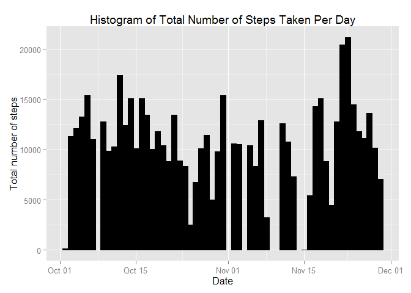
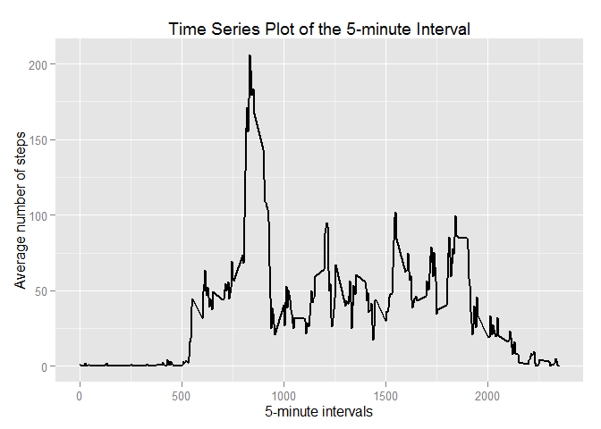
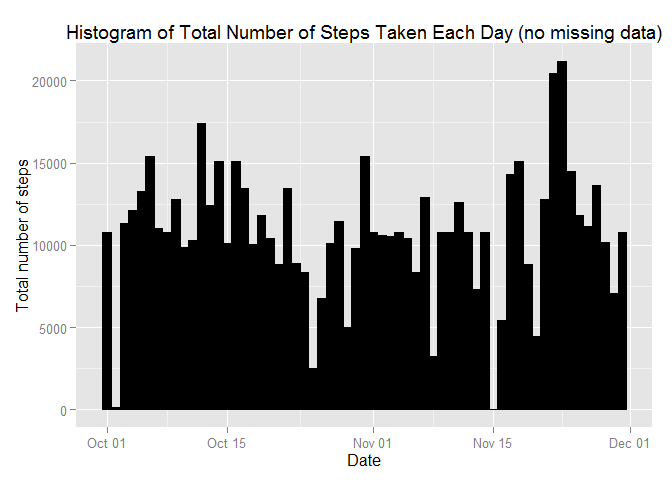

# Reproducible Research: Peer Assessment 1


```r
options(scipen=1) # fixed notation 
echo=TRUE # echo code
```


## Loading and preprocessing the data

```r
library(utils)
library(ggplot2)
unzip("activity.zip")
df<-read.csv("activity.csv",colClasses=
                 c("integer","Date","integer"))
df_full<-na.omit(df)
```


## What is mean total number of steps taken per day?


* Obtain the mean and the median of total steps taken per day

Obtain a vector containing the total of steps per day

```r
totalSteps_Day<-aggregate(x=df_full$steps,by=list(df_full$date),FUN="sum")$x
```

* Plot a histogram of the steps taken per day

```r
ggplot(df_full, aes(date, steps)) + geom_histogram(stat = "identity", colour = "black", fill = "black", width = 1)+ labs(title = "Histogram of Total Number of Steps Taken Per Day", x = "Date", y = "Total number of steps")
```

 


* Report the mean and the median 

```r
mean(totalSteps_Day)
```

```
## [1] 10766.19
```

```r
median(totalSteps_Day)
```

```
## [1] 10765
```


## What is the average daily activity pattern?

```r
meanSteps_interval <- aggregate(x=df_full$steps, list(interval = df_full$interval), FUN = "mean")
names(meanSteps_interval)[2] <- "meanSteps"
```
* time series plot (i.e. type = "l") of the 5-minute interval (x-axis) and the average number of steps taken, averaged across all days (y-axis)

```r
ggplot(meanSteps_interval, aes(interval, meanSteps)) + geom_line(color = "black", size = 1) + labs(title = "Time Series Plot of the 5-minute Interval", x = "5-minute intervals", y = "Average number of steps")
```

 
* 5 min interval with the max number of steps

```r
meanSteps_interval[meanSteps_interval$meanSteps == max(meanSteps_interval$meanSteps), ][1]
```

```
##     interval
## 104      835
```

## Imputing missing values

* Number of missing values 

```r
sum(is.na(df))
```

```
## [1] 2304
```
* Devise a strategy for filling in all of the missing values in the dataset

Approach used: fill the missing values with the mean for that 5-minute interval

```r
df2<-df
for (i in 1:nrow(df)) {
  if (is.na(df2$steps[i])) {
    val<-meanSteps_interval[which(df2$interval[i] == meanSteps_interval$interval),]
    df2$steps[i] <- val$meanSteps
  }
}
```

* Make a histogram of the total number of steps taken each day and calculate and report the mean and median total number of steps taken per day


```r
ggplot(df2, aes(date, steps)) + geom_bar(stat = "identity",
                                             colour = "black",
                                             fill = "black",
                                             width = 1) + labs(title = "Histogram of Total Number of Steps Taken Each Day (no missing data)", x = "Date", y = "Total number of steps")
```

 

* Do these values differ from the estimates from the first part of the assignment? What is the impact of imputing missing data on the estimates of the total daily number of steps?

The total daily number of steps is given for the old dataset (df) as totalSteps_Day. We generate a new vector containing the total number of steps for the new dataset (df2)

```r
totalSteps_Day2<-aggregate(x=df2$steps,by=list(df2$date),FUN="sum")$x
```
The estimates on the total daily number of steps are given by the mean and the median. 

```r
df.mean<-mean(totalSteps_Day)
df2.mean<-mean(totalSteps_Day2)
df.median<-median(totalSteps_Day)
df2.median<-median(totalSteps_Day2)
comp<-data.frame(c("df","df2"),c(df.mean,df2.mean),c(df.median,df2.median))
colnames(comp)<-c("Dataset","Mean","Median")
comp
```

```
##   Dataset     Mean   Median
## 1      df 10766.19 10765.00
## 2     df2 10766.19 10766.19
```
The new mean of total steps taken per day is the same as that of the old mean; the new median of total steps taken per day is greater than that of the old median (no longer an integer & closes on the mean due to the inputed data).

## Are there differences in activity patterns between weekdays and weekends?
* Create a new factor variable in the dataset with two levels -- "weekday" and "weekend" indicating whether a given date is a weekday or weekend day.


```r
head(df2)
```

```
##       steps       date interval
## 1 1.7169811 2012-10-01        0
## 2 0.3396226 2012-10-01        5
## 3 0.1320755 2012-10-01       10
## 4 0.1509434 2012-10-01       15
## 5 0.0754717 2012-10-01       20
## 6 2.0943396 2012-10-01       25
```

```r
df2$weekdays <- factor(format(df2$date, "%a"))
levels(df2$weekdays)
```

```
## [1] "Fri" "Mon" "Sat" "Sun" "Thu" "Tue" "Wed"
```

```r
levels(df2$weekdays) <- list(
  weekday = c("Mon", "Tue","Wed", "Thu", "Fri"),
  weekend = c("Sat", "Sun"))
levels(df2$weekdays)
```

```
## [1] "weekday" "weekend"
```

```r
table(df2$weekdays)
```

```
## 
## weekday weekend 
##   12960    4608
```

* Make a panel plot containing a time series plot (i.e. type = "l") of the 5-minute interval (x-axis) and the average number of steps taken, averaged across all weekday days or weekend days (y-axis).


```r
meanSteps_interval_week <- aggregate(df2$steps, 
                      list(interval = df2$interval, 
                           weekdays = df2$weekdays),
                      FUN = "mean")
names(meanSteps_interval_week)[3] <- "meanSteps"
library(lattice)
xyplot(meanSteps_interval_week$meanSteps ~ meanSteps_interval_week$interval | meanSteps_interval_week$weekdays, 
       layout = c(1, 2), type = "l", 
       xlab = "Interval", ylab = "Number of steps")
```

 
